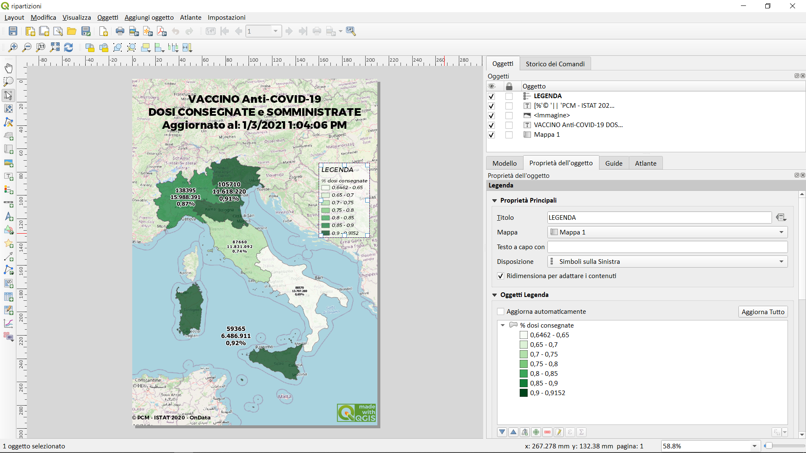
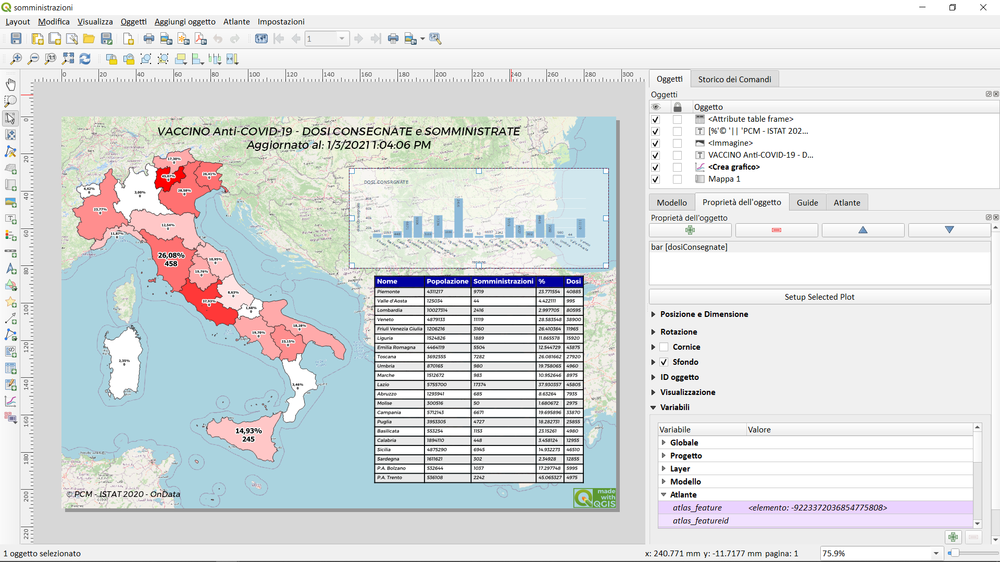
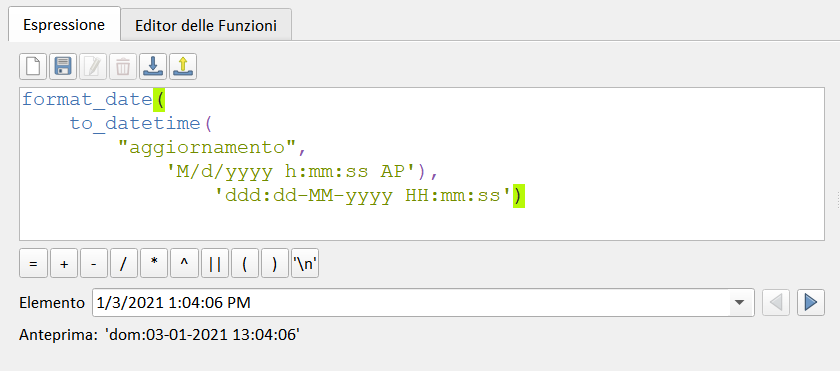

# vaccini
report somministrazioni vaccini anti COVID-19

sito: <https://app.powerbi.com/view?r=eyJrIjoiMzg4YmI5NDQtZDM5ZC00ZTIyLTgxN2MtOTBkMWM4MTUyYTg0IiwidCI6ImFmZDBhNzVjLTg2NzEtNGNjZS05MDYxLTJjYTBkOTJlNDIyZiIsImMiOjh9&fbclid=IwAR0m1KfqlcnLUvXLfRfTtNQLi2D2TsQmXat3Mje1TqI1cvNOhauX7BaGsis>

## contenuto

in lavorazione

- shapefile italia 21 regioni
- shapefile ripartizioni geografiche
- virtualfile collegati al [repository di OnData](https://github.com/ondata/covid19italia/tree/master/webservices/vaccini)
- progeto QGIS con layout di stampa
- 


### layout stampa

### layout stampa


### formato data

```
format_date(
	to_datetime(
		"aggiornamento", 
			'M/d/yyyy h:mm:ss AP'),
				'ddd:dd-MM-yyyy HH:mm:ss')
```



### riferimenti utili

- **repository OnData** : <https://github.com/ondata/covid19italia/tree/master/webservices/vaccini>
- **QGIS** : <https://www.qgis.org/it/site/>